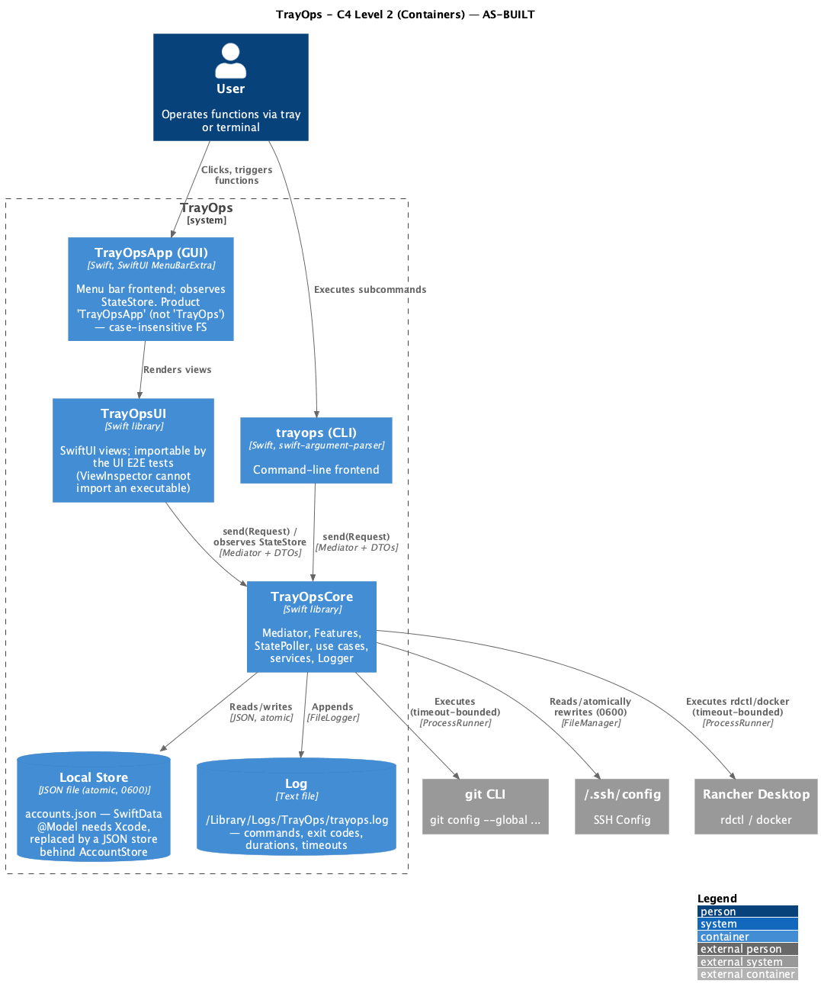

# As-Built State: TrayOps Platform

> **SDD increment.** This document reconciles the **delivered** system with `spec.md`
> and `plan.md`, which describe the system as *planned*. Per `CLAUDE.md` ("when code
> and spec diverge, create a new increment artifact"), this is the artifact that
> shows the **current state**.
>
> In Unified Process terms this is the model set at its **as-built (prescribed)
> state** at the end of cycle 1 — the *Product Release* milestone. The architecture
> is proven by the **executable baseline** (the app runs + the suite is green), not
> by paper.

## 1. Current state — what is delivered

- **Two Functions**, each with state, actions and a single 15s-polled `refresh()`:
  **GitHub Account** (consistent / inconsistent / unknown, via git `user.name` +
  active SSH `IdentityFile`; Set / Reconcile / account CRUD) and **Docker Control**
  (online / offline / transitioning / unavailable; Start / Shut Down via `rdctl`).
- **Two interchangeable frontends** over the same `AppComposition`: the SwiftUI
  menu-bar GUI and the `trayops` CLI (full parity).
- **Platform services**: Mediator command bus, `StatePoller` (15s), observable
  `StateStore`, `RefreshAll` / `ReconcileAll`.
- **Quality**: 82 tests green across 22 suites (Core unit/integration with real
  git over a sandbox, CLI E2E on the real binary, UI E2E via ViewInspector).
- **Packaging & ops**: `.app` bundle (`make app`/`make install`), generated app
  icon, CLI on `PATH`, file logging + external-call timeouts, MIT `LICENSE`.

Cycle/milestone: **Product Release** (end of the first development cycle).

## 2. Deviations from `spec.md` / `plan.md`

The plan was followed except where a hard environment constraint or a reviewed
improvement required a decision. Each was decided with the user.

| # | Area | Planned (spec/plan) | As-built | Rationale |
|---|---|---|---|---|
| D1 | Persistence | SwiftData (`@Model`, `ModelContainer`); plan §3.1 | **Local JSON store** (`JSONAccountStore`) behind the same `AccountStore` protocol; atomic write, `0600` | The `@Model` macro plugin ships **only with Xcode**, which the project excludes. Domain/handlers/Feature unchanged (boundary held). |
| D2 | Target & directory layout | 3 targets: `Sources/TrayOps` (GUI), `Sources/trayops` (CLI), `TrayOpsCore`; plan §1 | 4 targets: `TrayOpsCore`, **`TrayOpsUI`** (views library), `TrayOpsGUI`→product **`TrayOpsApp`**, `TrayOpsCLI`→product `trayops` | `TrayOps`/`trayops` collide on the case-insensitive macOS FS (same module/binary). ViewInspector cannot import an executable, so views moved to a library. |
| D3 | Composition boundary | `AppComposition` swaps `ProcessRunner`, `HOME`/paths, **`ModelContainer`**; plan §1 | Swaps `ProcessRunner`, paths, **`accountsStoreURL`** and **`logger`** | Follows D1; the store URL replaces the SwiftData container at the boundary. |
| D4 | Test execution | `swift test`; plan §5.4 | **`scripts/test.sh`** / `make test` (adds framework/rpath flags + `--disable-xctest`) | The Command Line Tools (no Xcode) have no XCTest runner and ship Swift Testing off the default search path. A swift.org toolchain (swiftly) is installed but **not** used to build — its AVKit overlay drops `VideoPlayer` on the macOS 26 SDK, breaking ViewInspector. |
| D5 | Observability | Personal scope: no telemetry; errors to UI/CLI stderr; `os_log` optional; spec §5.5 | **Added** a `FileLogger` → `~/Library/Logs/TrayOps/trayops.log` (commands, exit codes, durations, timeouts) and a **timeout** on every external call (`ProcessRunner`, default 30s, `TRAYOPS_PROCESS_TIMEOUT`) | Reviewed enhancement: troubleshooting + no stalled poller on a hung tool. Stays local and user-only; only `IdentityFile` paths are logged, never key contents (RN-GH-08). |
| D6 | RN-P-07 wording | "Adding a Feature requires no changes to the core, frontends, or existing Functions" | Core/Mediator/poller/existing Features unchanged; **each frontend gains one addition** (a `RootPanelView` case + a CLI subcommand) | Rendering/parsing a new Function is inherent to a frontend; not a change to existing behavior. Wording corrected in `CLAUDE.md`. |

The C4 diagrams in `plan.md` (`diagrams/c4-n2-containers`, `c4-n3-components`) still
show the planned containers (SwiftData, 3 targets). The as-built container view is
below; the component view is unchanged in intent (the `AccountStore` implementation
swapped, the protocol did not).

## 3. As-built architecture — Containers (C4 Level 2)



Source: [`diagrams/c4-n2-as-built.puml`](diagrams/c4-n2-as-built.puml).

Module map (as-built):

```
Sources/TrayOpsCore/   library  — Mediator, Platform (Feature/Registry/StateStore/StatePoller),
                                  Composition, System (ProcessRunner/BinaryLocator/Logger), Features/*
Sources/TrayOpsUI/     library  — SwiftUI views (imported by the GUI and the UI E2E tests)
Sources/TrayOpsGUI/    exe      — @main MenuBarExtra shell  → product "TrayOpsApp"
Sources/TrayOpsCLI/    exe      — swift-argument-parser      → product "trayops"
```

## 4. As-built model views (UP)

- **Use-Case view (outside):** `spec.md` is current — the Functions, journeys and
  business rules (RN-*) hold as delivered. No functional deviation.
- **Design / Implementation view (inside):** as in `plan.md` §1–§4, with D1–D3
  applied — `AccountStore` is JSON-backed; `Logger` added to `SystemEnvironment`;
  `ProcessRunner` is timeout-bounded; `StateStore` and `AccountTarget` are
  lock-guarded for concurrency safety.
- **Deployment view:** the GUI is a `LSUIElement` `.app` (menu bar, no Dock); the
  CLI is a binary on `PATH`. Local stores: `~/Library/Application Support/TrayOps/accounts.json`
  and `~/Library/Logs/TrayOps/trayops.log`. See `INSTALL.md`.
- **Test view:** suites in `Tests/` exercise the real entry points on the same
  `AppComposition`; 82 tests green is the executable-baseline evidence.

## 5. Verification of the current state

| Aspect | Command / evidence |
|---|---|
| Build | `swift build` (4 targets) |
| Run | `swift run TrayOpsApp` · `swift run trayops <subcommand>` |
| Tests | `./scripts/test.sh` (or `make test`) — 82 tests, 22 suites |
| Install (permanent) | `make install` (app to `/Applications` + `trayops` on `PATH`) |
| Logs | `~/Library/Logs/TrayOps/trayops.log` |

## 6. Open items (post-review backlog, non-blocking)

Recorded for traceability; deferred as low value for a personal-scope app:
ssh `Match`/wildcard/inline-comment edge cases beyond what is handled; an injectable
clock for the poller test; a UI E2E asserting the real panel tap→Mediator wiring
(currently covered indirectly); request-type prefix harmonization. None affect the
delivered behavior.
