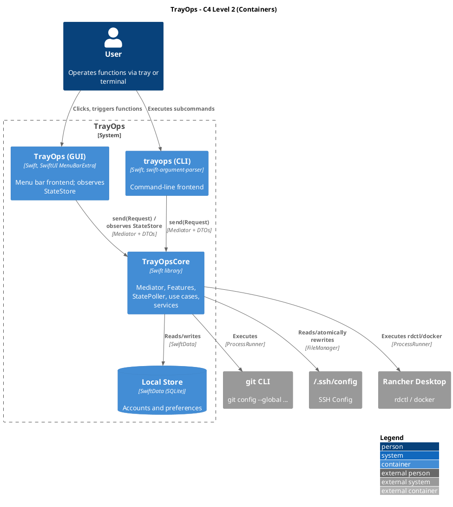
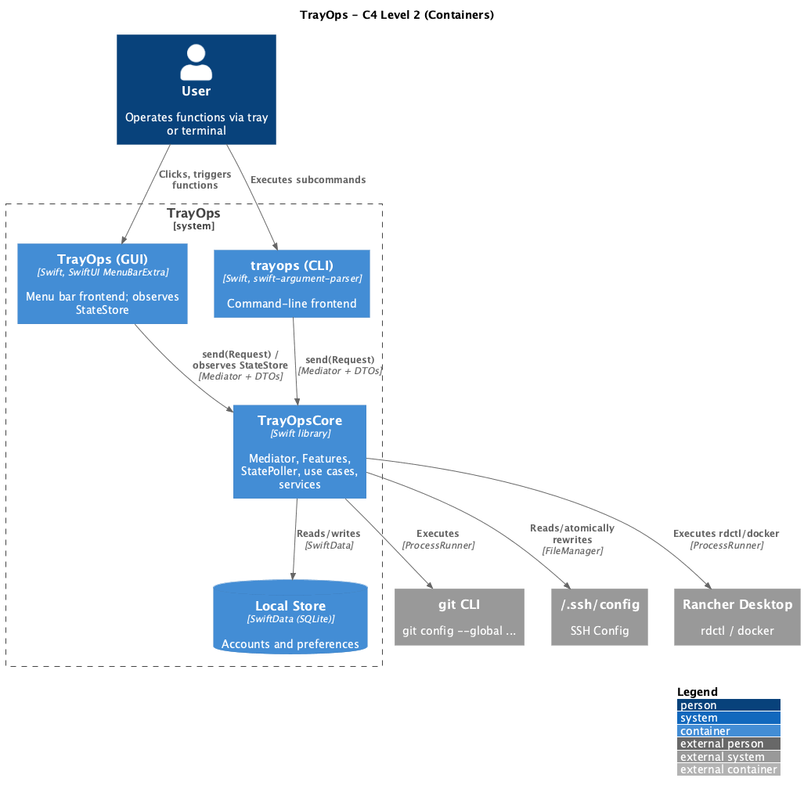
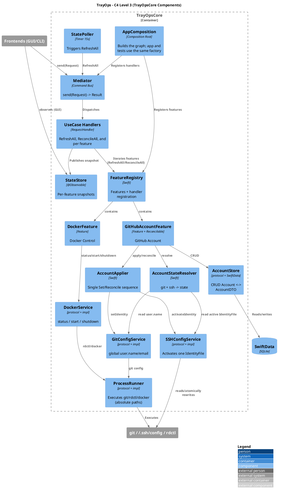
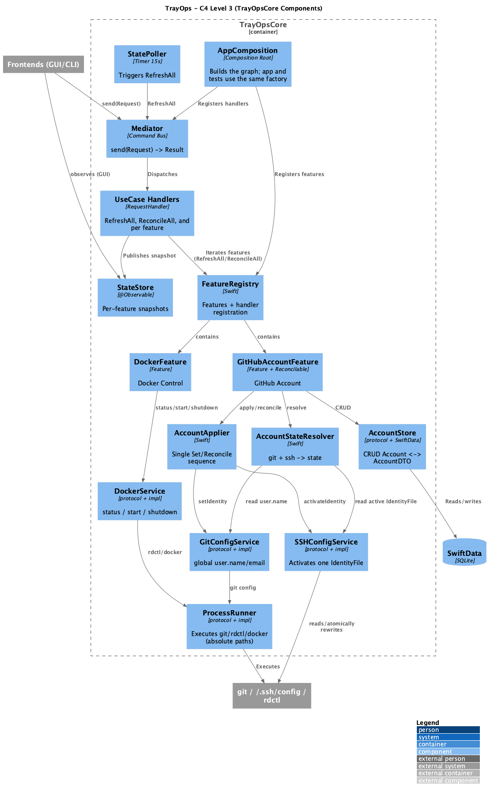
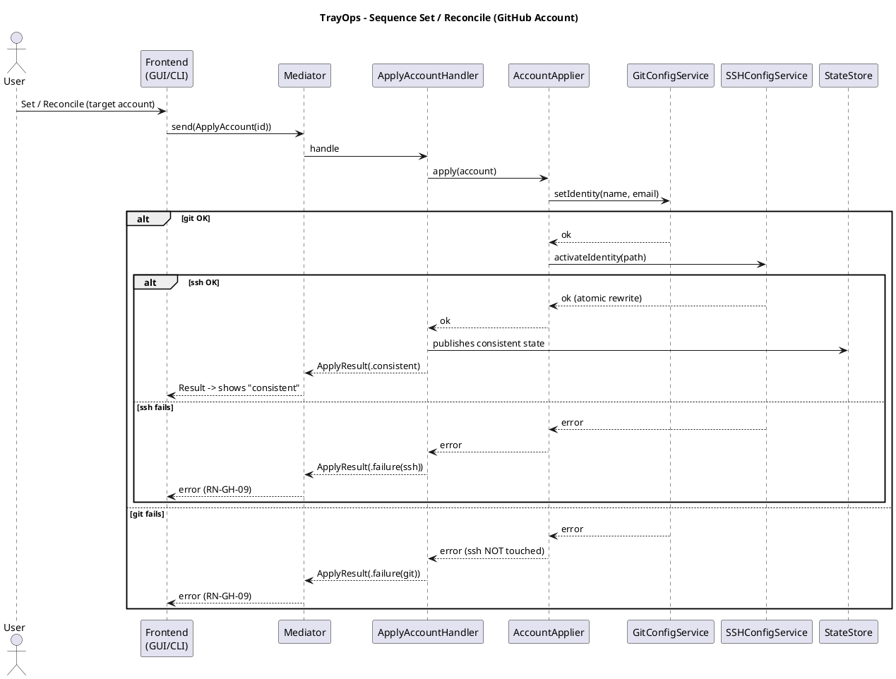
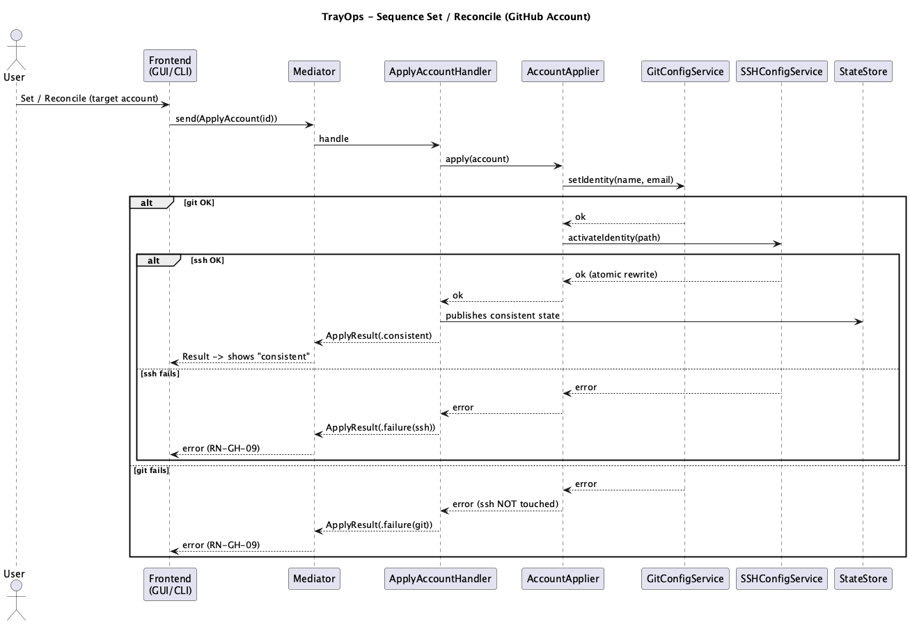
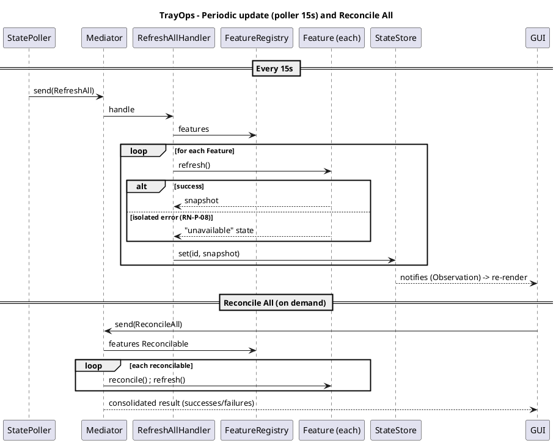
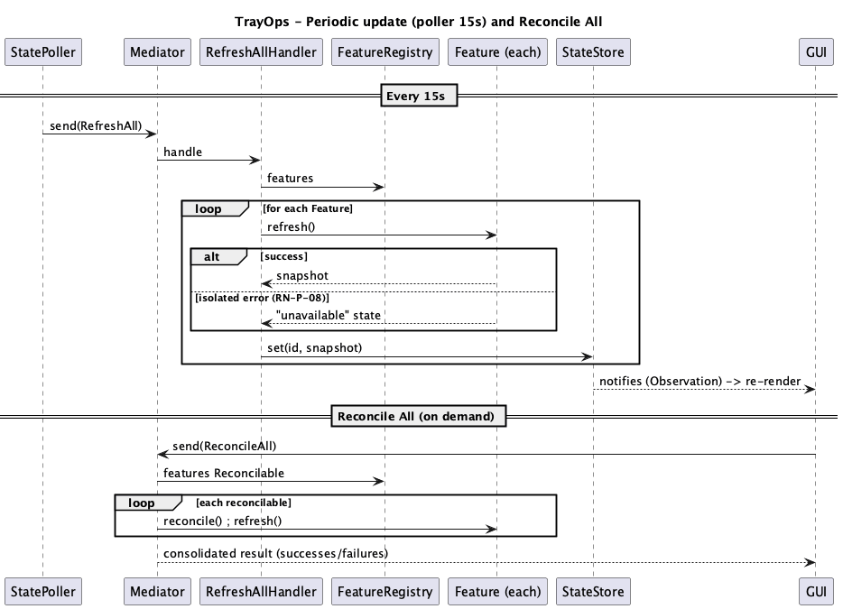
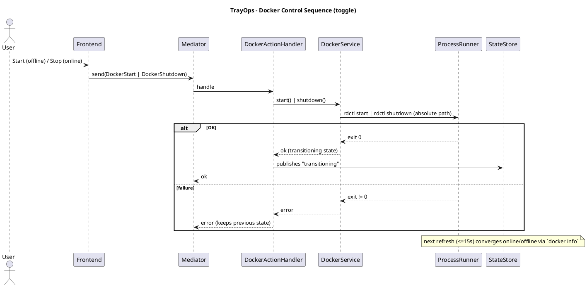
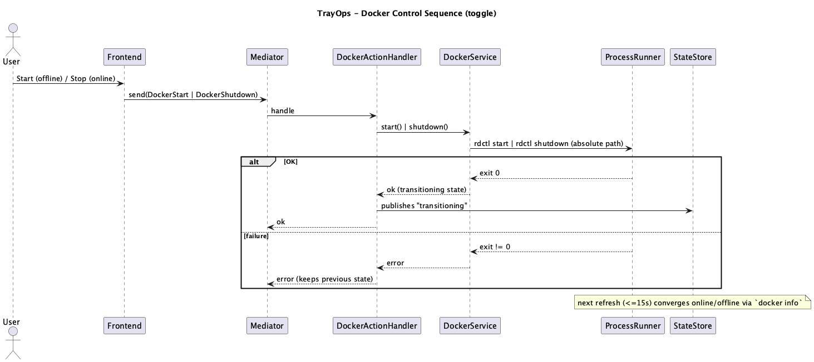

# Technical Planning: TrayOps Platform and Initial Functions

> Prerequisite: `spec.md` approved. Personal macOS project, Swift 6.3 + SPM, **with tests** (emphasis on E2E CLI + UI). Corporate backend stack (web/messaging frameworks) **does not apply**.

## 1. Architecture Overview

- **Main Decision:** A **UI-agnostic domain core** (`TrayOpsCore`) exposed via a **Mediator (command bus)**. The interfaces — menu bar GUI (SwiftUI `MenuBarExtra`) and CLI (`trayops`) — are **interchangeable frontends of the same service**: they emit `Request`s and receive `Result`s (DTOs), **without knowledge of** services, handlers, or persistence. The domain **does not know the frontend** (no `import SwiftUI` or terminal inside the core).
- **Function Platform:** each utility is a **`Feature`** registered in the `FeatureRegistry`. Every Feature has a **single state update method** (`refresh`), actions (via Requests), and optionally, **reconciliation**. A **`StatePoller`** updates all Functions every **15s**; an observable `StateStore` publishes the snapshots; a **ReconcileAll** use case iterates over reconcilable Functions.
- **Single Composition Root:** a factory (`AppComposition`) builds the graph (registry, mediator, handlers, services, store). **App and tests use the same factory**, swapping only the **system boundaries** (`ProcessRunner`, `HOME`/paths). This is what guarantees "E2E passed ⇒ app works".
- **SOLID:** Mediator/Command Bus (decoupling); SRP (1 handler per use case); OCP (new Feature = register handlers, without touching core/frontends); LSP/ISP (small services behind protocols); DIP (everything depends on abstractions); boundary via **DTO** (frontend agnostic even of SwiftData).
- **Persistence:** **SwiftData** behind the `AccountStore`; Keychain reserved for future secrets.
- **Build/Run — SPM package with 3 targets + tests:**

  | Target | Type | Knows | Does not know |
  |---|---|---|---|
  | `TrayOpsCore` | library | domain, mediator, handlers, services, SwiftData, Observation | SwiftUI, terminal |
  | `TrayOps` | executable (GUI) | `TrayOpsCore` (Mediator + DTOs + StateStore) | handlers, services |
  | `trayops` | executable (CLI) | `TrayOpsCore` (Mediator + DTOs) | handlers, services |
  | `TrayOpsCoreTests` / `TrayOpsCLITests` / `TrayOpsUITests` | testTargets | the Composition Root + fakes | — |

  - GUI without Dock via `NSApplication.shared.setActivationPolicy(.accessory)`. CLI with `swift-argument-parser`. UI tests with **ViewInspector**. Framework: **Swift Testing**.
  - Runs with `swift run TrayOps`, `swift run trayops <subcommand>`, `swift test`. No Xcode GUI.
- **Affected repository:** `trayops` (this one).

### 1.1 Extensible and agnostic base (project core)

```swift
// === TrayOpsCore (UI-agnostic) ===
protocol FeatureState: Sendable {}                 // snapshot typed per Feature

protocol Feature: AnyObject, Identifiable {
    var id: String { get }                         // e.g.: "github-account", "docker"
    var title: String { get }
    var systemImage: String { get }                // SF Symbol (string only)
    func registerHandlers(on mediator: Mediator)   // OCP
    func commands() -> [FeatureCommand]            // declarative CLI -> Request description
    func refresh() async -> any FeatureState       // SINGLE state refresh method (RN-P-01)
}

protocol Reconcilable {                             // optional: only Functions with a desired state
    func reconcile() async throws                   // GitHub adopts it; Docker does not
}

@Observable final class StateStore {               // Observation (no SwiftUI)
    private(set) var snapshots: [String: any FeatureState]   // by feature.id
    func set(_ id: String, _ state: any FeatureState)
}

final class StatePoller {                           // 15s timer -> RefreshAll
    init(intervalSeconds: TimeInterval = 15, mediator: Mediator)
    func start(); func stop()
}
```

- `FeatureRegistry` maintains the Functions and registers all handlers in the Mediator at bootstrap.
- GUI iterates views per Feature and observes the `StateStore`; CLI iterates `commands()` and dispatches via Mediator. **Both** without business logic.
- Adding a Function = implement `Feature` (+ `Reconcilable` if applicable) and register in `FeatureRegistry`. Core, Mediator, poller, reconcile-all, and frontends do not change (RN-P-07).
- Failure isolation (RN-P-08): `refresh()`/actions of a Feature are captured individually; a failure becomes "unavailable state" without affecting the others.

## 2. Solution Diagrams

### 2.1 C4 — Level 2 (Containers)





### 2.2 C4 — Level 3 (TrayOpsCore Components)





### 2.3 Sequence — Set / Reconcile (GitHub Account; success + failure)





### 2.4 Sequence — Periodic state refresh (15s poller) and Reconcile All





### 2.5 Sequence — Docker Control (toggle)





## 3. Data Modeling and Persistence

### 3.1 SwiftData Model (internal) and boundary DTOs

```swift
@Model
final class Account {                 // internal — never crosses the boundary
    @Attribute(.unique) var id: UUID
    var label: String
    var gitName: String
    var gitEmail: String
    var identityFile: String
    var sortIndex: Int
    var createdAt: Date
    var updatedAt: Date
}

struct AccountDTO: Sendable, Identifiable, Equatable {   // boundary
    let id: UUID; let label, gitName, gitEmail, identityFile: String
}

// States (FeatureState) per Function
enum GitHubAccountState: FeatureState {
    case consistent(AccountDTO)
    case inconsistent(git: AccountDTO?, ssh: AccountDTO?)
    case unknown
    case unavailable(reason: String)
}
enum DockerState: FeatureState {
    case online, offline, transitioning, unavailable(reason: String)
}
```

| `Account` Field | Type | Required | Description |
|---|---|---|---|
| `id` | UUID | Yes | Unique (`.unique`) |
| `label` | String | Yes | Label / GitHub username |
| `gitName` | String | Yes | `git config --global user.name` |
| `gitEmail` | String | Yes | `git config --global user.email` |
| `identityFile` | String | Yes | `IdentityFile` path |
| `sortIndex` | Int | Yes | Display order |
| `createdAt`/`updatedAt` | Date | Yes | Local audit |

### 3.2 Seed (first run — RN-GH-05)

Seed is **unversioned local configuration**. `AccountStore.seedIfEmpty()` resolves the seed JSON file in order: (1) env `TRAYOPS_SEED_PATH`; (2) `accounts.seed.json` at the project root (gitignored); (3) `~/.config/trayops/accounts.seed.json`. If none exists, the list starts **empty** (the user registers accounts via GUI/CLI). In all cases the actual file is **unversioned**. Format (fictional example versioned in `accounts.seed.example.json`):

```json
{
  "accounts": [
    { "label": "personal", "gitName": "octocat", "gitEmail": "you@example.com", "identityFile": "~/.ssh/id_ed25519" }
  ]
}
```

No personal data (email, identity, key path) is versioned. The `.gitignore` blocks `*.seed.json` / `*.local.json` as defense in depth.

### 3.3 Physical location

- `~/Library/Application Support/TrayOps/` (`ModelContainer` default). In tests, **in-memory** container or `HOME` sandbox.

## 4. Integration Contracts (Internal Interfaces)

No REST/messaging. The **public boundary** is Mediator + Requests + DTOs + StateStore; everything else is internal.

### 4.1 Mediator (public boundary)

```swift
protocol Request { associatedtype Output }
protocol RequestHandler { associatedtype R: Request; func handle(_ r: R) async throws -> R.Output }
protocol Mediator {
    func register<H: RequestHandler>(_ handler: H)
    func send<R: Request>(_ request: R) async throws -> R.Output
}
```

### 4.2 Requests — GUI ↔ CLI parity (RN-P-05)

| Request | Output | Operation | GUI | CLI |
|---|---|---|---|---|
| `RefreshAll` | `Void` | Updates all states | poller / open panel | `status` (refresh + prints) |
| `ReconcileAll` | `ReconcileReportDTO` | Reconcile All | "Reconcile All" button | `reconcile-all` |
| `ResolveGitHubState` | `GitHubAccountState` | Account state | panel | `github status` |
| `ListAccounts` | `[AccountDTO]` | List accounts | picker | `github list` |
| `ApplyAccount(id)` | `ApplyResultDTO` | Set | Set button | `github set <label>` |
| `ReconcileAccount(id)` | `ApplyResultDTO` | Reconcile account | Reconcile button | `github reconcile [<label>]` |
| `AddAccount/UpdateAccount/RemoveAccount` | `AccountDTO`/`Void` | CRUD | config form | `github account add/edit/remove` |
| `ResolveDockerState` | `DockerState` | Docker state | panel | `docker status` |
| `DockerStart` | `Void` | Start | Start button | `docker start` |
| `DockerShutdown` | `Void` | Shutdown | Shutdown button | `docker shutdown` |

### 4.3 Internal services (protocols — DIP/ISP)

```swift
protocol GitConfigService {
    func currentUserName() async throws -> String?
    func currentUserEmail() async throws -> String?
    func setIdentity(name: String, email: String) async throws
}
protocol SSHConfigService {
    func activeIdentityFile(host: String) async throws -> String?
    func activateIdentity(path: String, host: String) async throws   // one active, the rest commented out
}
protocol AccountApplier { func apply(_ a: Account) async throws }     // Set AND Reconcile (RN-GH-10)
protocol AccountStateResolver { func resolve(accounts: [Account]) async throws -> GitHubAccountState }
protocol DockerService {
    func status() async -> DockerState     // docker info → online/offline
    func start() async throws              // rdctl start
    func shutdown() async throws           // rdctl shutdown
}
protocol AccountStore {
    func all() throws -> [Account]
    func add(_:) throws; func update(_:) throws; func remove(_:) throws
    func seedIfEmpty() throws
}
protocol ProcessRunner { func run(_ executable: String, _ args: [String]) async throws -> ProcessOutput }
protocol BinaryLocator { func path(for tool: String) -> String? }     // resolve absolute rdctl/docker/git paths (RN-DK-03)
```

- `SSHConfigService` applies RN-GH-02/07 and the edge cases from spec §6; **atomic** write (`.atomic`), permissions `0600`.
- `DockerService.status()` uses `docker info` (exit 0 = online). `BinaryLocator` resolves absolute paths (e.g.: `~/.rd/bin/...`), since the macOS GUI does not inherit the shell PATH.

## 5. Resilience, Security, Errors and Tests

### 5.1 Failure Matrix

| Component | Failure | Strategy | Impact |
|---|---|---|---|
| `git` | Missing / exit ≠ 0 | Typed error; abort before ssh | Message; state unchanged (RN-GH-09); CLI exit ≠ 0 |
| `~/.ssh/config` | Non-existent / no host / multiple IdentityFile | Create/insert/normalize preserving the rest | Transparent |
| `~/.ssh/config` | No permission / IO | Abort; preserve original; report | File intact |
| `rdctl`/`docker` | Missing | `BinaryLocator` fails → Function "unavailable", actions disabled | Platform continues (RN-P-08) |
| `rdctl start/shutdown` | exit ≠ 0 | Report; maintain state; converge on state refresh | Transient error |
| `refresh()` of a Feature | Exception | Capture per Feature → "unavailable" | Remaining Functions continue (RN-P-08) |
| SwiftData | Failure to open | Report; prevent use | Initialization error |

### 5.2 Security

- **Never** read/display/log private key content — only the **path** (RN-GH-08).
- Rewriting `~/.ssh/config` preserves `0600`; original is kept until the atomic write completes.
- No secrets at this stage; Keychain reserved for future tokens. App has no network access and no elevated privileges.

### 5.3 Idempotency

- Applying the same account repeatedly produces the same `~/.ssh/config` and git config (without duplicating lines) — covered by test.

### 5.4 Test Strategy (Swift Testing)

Principle: **the same `AppComposition` from the app is used in tests**, swapping only the system boundaries. "E2E passed ⇒ app functional".

| Suite | Target | Boundaries | Tool |
|---|---|---|---|
| Unit | `~/.ssh/config` parser/writer, `AccountStateResolver`, DTO mappings | No I/O | Swift Testing |
| Core integration | Mediator + handlers + real services on sandbox | real git (`GIT_CONFIG_GLOBAL` temp), ssh in `HOME` temp, fake `ProcessRunner` for docker | Swift Testing |
| **E2E CLI** | Real `trayops` binary, subcommands | `HOME`/git/ssh sandbox; docker via fake runner | Swift Testing (Process) |
| **E2E UI** | Real SwiftUI views connected to real core (Set/Reconcile/Start/Shutdown, state, state refresh) | same as core | Swift Testing + **ViewInspector** |

System boundaries in tests:

| Boundary | Treatment | Reason |
|---|---|---|
| `git` | Real, isolated via `GIT_CONFIG_GLOBAL` = temp file | Deterministic and faithful; does not touch the environment |
| `~/.ssh/config` | Real, temporary file in `HOME` sandbox | Validates actual rewriting/idempotency |
| `rdctl`/`docker` | **fake** `ProcessRunner` (scripted exit codes) | Starting/stopping real Docker is non-deterministic |
| SwiftData | In-memory `ModelContainer` | Isolation between tests |

### 5.5 Observability

- Personal scope: no telemetry. Errors in UI / CLI stderr; `os_log` optional. (Corporate observability stack does not apply.)

## 6. Rationale and Trade-offs

| Decision | Discarded Alternative | Rationale |
|---|---|---|
| Agnostic core + **Mediator** + **DTOs** | Frontends calling services directly / exposing `@Model` | Domain does not know the frontend; swap/add frontends without touching the core |
| Shared app/tests **Composition Root** | Separate graphs | Ensures E2E reflects the real app |
| `Feature` + `FeatureRegistry` + `StatePoller` + `StateStore` | Monolithic app | Extensible platform with periodic state (RN-P-01/02/07) |
| Optional `Reconcilable` | mandatory reconcile on every Feature | Docker has no desired state; only reconciles where it makes sense |
| `BinaryLocator` (absolute paths) | Trusting PATH | macOS GUI does not inherit shell PATH (RN-DK-03) |
| **Swift Testing** + **ViewInspector** (E2E in SPM) | XCUITest + Xcode project | "Boundary" confidence without tray or Xcode flakiness; keeps SPM/VSCode |
| `docker info` for status | `rdctl info` parsing | Simple exit code faithful to usable engine |
| SwiftData | JSON / GRDB / server-database | Native ACID with no dependencies or Docker |
| `swift-argument-parser` | Manual parsing | Apple standard; native subcommands/help/validation |
